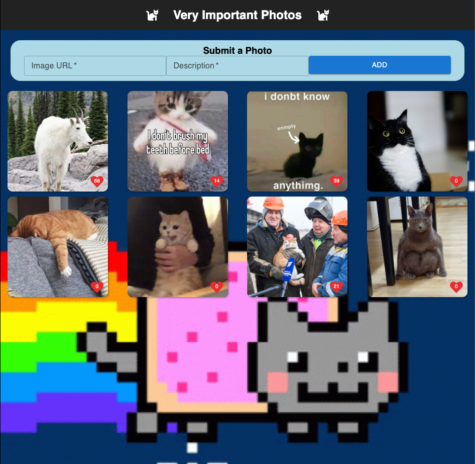

# React Image Gallery

## Description

*Duration: 3 day task*

A full-stack CRUD application to display stored photos and their descriptions, track photo likes, remove photos, and accept additional photo submissions by image URL.

## Screen Shot

## Prerequisites

-Node.js
-PostgreSQL
-PostgreSQL client like Postico

## Installation

1. Fork and clone repos
2. `npm install` to acquire the required dependencies
3. Create a new SQL database named 'react_gallery'
4. Run the CREATE TABLE  and INSERT INTO scripts from 'database.sql' to initialize the gallery table
5. `npm run server` to start server
6. `npm run client` to start the client-side development build and automatically connect to localhost:3000 in the browser

## Usage

1. Connect to localhost:3000 to view the pre-loaded images
2. Click on a photo to display the description for that photo.
3. Click on the heart icon to record a 'like' for the photo
4. Mouse over an image to reveal the delete icon in the upper-right-hand corner. Click the 'X' to remove the image and associated data from the database.
5. Complete the form with an Image URL and Description to store a new image in the database and display it on the page.

## Built With

- React.js
- Material UI
- Express.js

## Acknowledgements

Thanks to Prime Digital Academy, who equipped me to make this application a reality!

## Support

If you have questions about this app, please email rutherford.t.b@gmail.com
